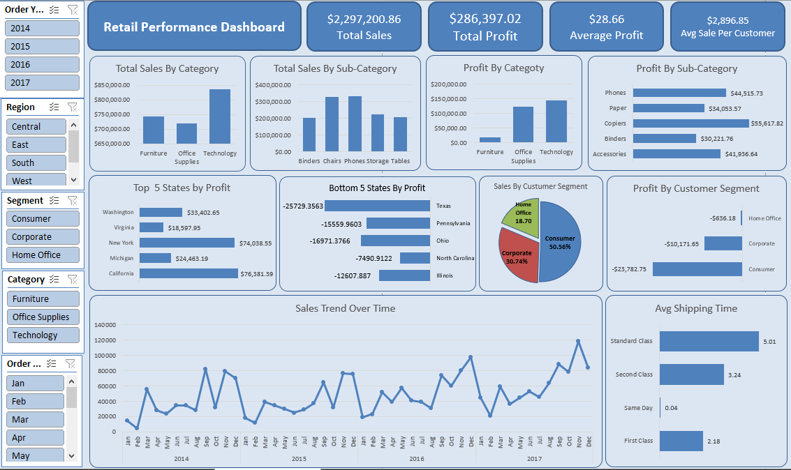

# Retail Performance Analytics Dashboard

## Project Overview
This project provides a comprehensive, end-to-end performance review of retail operations using Microsoft Excel. The interactive dashboard analyzes over $2.2M in sales data to uncover profitability drivers, geographic performance variations, customer segmentation, and operational efficiencies.

## Key Business Insights

* **Overall Financial Performance:** The operations generated **$2,297,200.86** in Total Sales and **$286,397.02** in Total Profit, averaging a profit of **$28.66** per order and an average sale of **$2,896.85** per customer.
* **Category Drivers:** Technology and Office Supplies are the primary profit drivers. While Furniture generates a high volume of sales (comparable to Office Supplies), it yields disproportionately low profit margins.
* **Geographic Extremes:** 
    * **Top Performers:** California (**$76,381.39**) and New York (**$74,038.55**) lead in profitability.
    * **High-Loss Regions:** Texas (**-$25,729.36**) and Ohio (**-$16,971.38**) are operating at a significant loss, indicating a need to review pricing or discount strategies in these states.
* **Customer Segmentation:** The Consumer segment is the largest revenue engine, accounting for **50.56%** of total sales volume, followed by the Corporate (**30.74%**) and Home Office (**18.70%**) segments.
* **Operational Efficiency (Shipping):** Order processing times scale logically across tiers: Same Day shipping averages **0.04 days**, First Class averages **2.18 days**, Second Class averages **3.24 days**, and Standard Class averages **5.01 days**.

## Technical Implementation
* **Tool:** Microsoft Excel
* **Data Processing:** Cleaned and structured raw transaction data. Added calculated fields to track temporal trends and operational processing time.
* **Analysis:** Utilized Pivot Tables and Pivot Charts to aggregate financial and operational metrics.
* **Visualization:** Designed a highly interactive executive dashboard featuring dynamic slicers (Order Year, Region, Segment, Category) and custom KPI cards for immediate high-level visibility.

## Author
**Muhammad Abdullah**  

## Dashboard Screenshot

